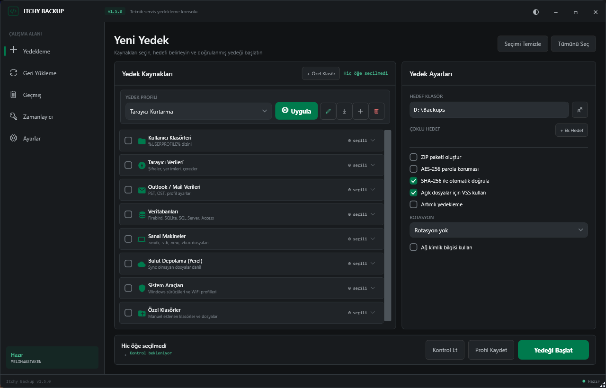
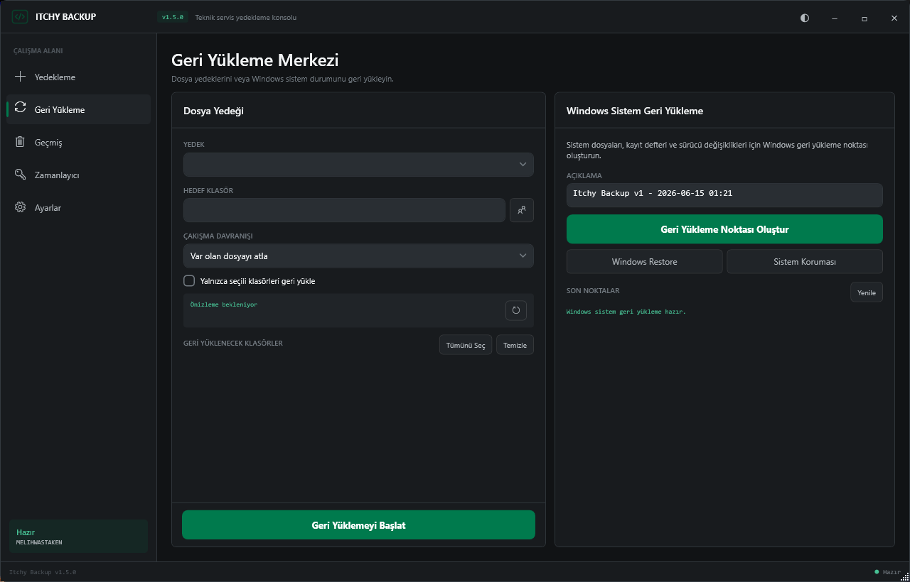
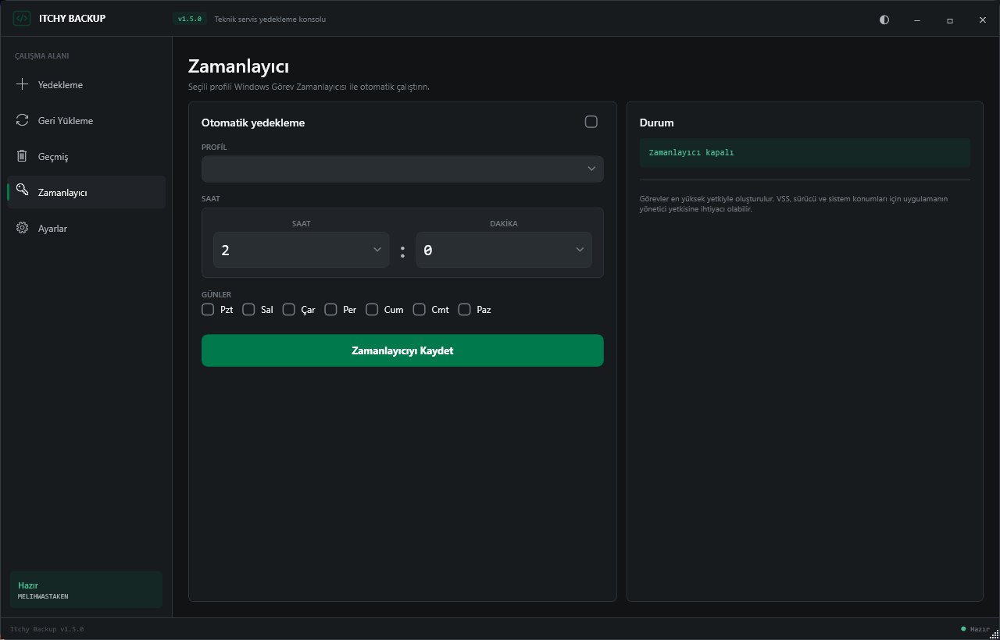
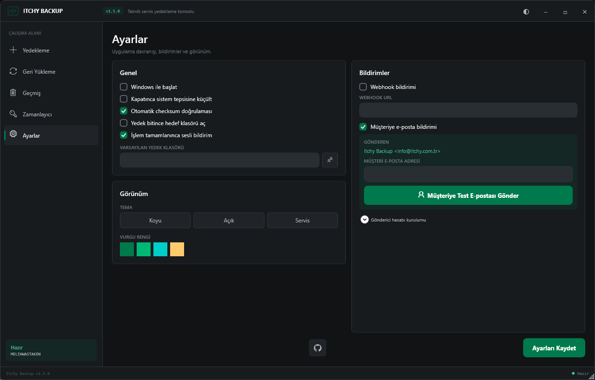
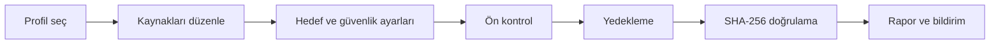

<div align="center">


### Teknik servisler için modern Windows yedekleme ve geri yükleme merkezi

Profiller, doğrulama, zamanlama, raporlama ve Windows kurtarma araçları tek bir masaüstü uygulamasında.

[](https://github.com/Bogazitchy/Itchy-Backup/releases)
[](https://github.com/Bogazitchy/Itchy-Backup/releases)
[](https://dotnet.microsoft.com/)
[](src/ItchyBackup/Views)

[**Sürümleri Gör ve İndir**](https://github.com/Bogazitchy/Itchy-Backup/releases) ·
[**Kaynak Kodu**](https://github.com/Bogazitchy/Itchy-Backup) ·
[**Sorun Bildir**](https://github.com/Bogazitchy/Itchy-Backup/issues)

</div>

---

## Genel Bakış

**Itchy Backup**, format ve teknik servis süreçlerinde gereken yedekleme adımlarını standartlaştırmak için geliştirilmiş bir Windows uygulamasıdır. Kullanıcı klasörlerinden tarayıcı profillerine, Outlook verilerinden sürücü ve Wi-Fi profillerine kadar farklı kaynakları tek işlemde yedekler.

| ⚡ Hızlı iş akışı | 🛡️ Doğrulanmış yedek | ♻️ Kontrollü geri yükleme |
|---|---|---|
| Hazır veya özel profil seç, hedefi belirle ve işlemi başlat. | SHA-256 manifesti, ön kontrol ve işlem raporlarıyla sonucu doğrula. | Klasör veya ZIP yedeğini kısmi seçim ve çakışma politikalarıyla geri yükle. |

| 🕒 Otomasyon | 🪟 Windows kurtarma | ✉️ Müşteri bildirimi |
|---|---|---|
| Profilleri Windows Görev Zamanlayıcısı ile belirli gün ve saatte çalıştır. | Sistem geri yükleme noktası oluştur ve Windows kurtarma araçlarına eriş. | İşlem sonucunu toast, webhook veya SMTP üzerinden müşteriye ilet. |

## Uygulama

<p align="center">
  
</p>

### Yedekleme Çalışma Alanı

- Tam genişlik profil seçici ve profil yönetim komutları
- İkonlu, katlanabilir yedek kategorileri
- Hedef, ZIP, AES-256, VSS, checksum, artımlı yedek ve rotasyon ayarları
- Çoklu hedef ve UNC/SMB ağ hesabı desteği
- Yedek öncesi kontrol, canlı ilerleme ve işlem iptali

<table>
  <tr>
    <td width="50%">
      
    </td>
    <td width="50%">
      
    </td>
  </tr>
  <tr>
    <td align="center"><strong>Geri Yükleme Merkezi</strong></td>
    <td align="center"><strong>Profil Zamanlayıcı</strong></td>
  </tr>
</table>

<p align="center">
  
</p>

## Neleri Yedekler?

| Alan | Desteklenen içerikler |
|---|---|
| 👤 **Kullanıcı klasörleri** | Masaüstü, Belgeler, İndirilenler, Resimler, Videolar, Müzik ve AppData |
| 🌐 **Tarayıcılar** | Chrome, Firefox, Edge, Opera, Brave ve Vivaldi profilleri |
| ✉️ **Outlook / Mail** | PST, OST, imzalar, şablonlar ve otomatik tamamlama verileri |
| 🗄️ **Veritabanları** | Firebird, SQLite, SQL Server ve Access dosyaları |
| 🖥️ **Sanal makineler** | VMware, VirtualBox ve Hyper-V disk/yapılandırma dosyaları |
| ☁️ **Bulut depolama** | OneDrive, Google Drive, MEGA ve Dropbox yerel içerikleri |
| 🧰 **Sistem araçları** | Windows sürücüleri, Wi-Fi profilleri ve sistem geri yükleme |
| 📁 **Özel klasörler** | Kullanıcının eklediği herhangi bir klasör veya dosya konumu |

## Öne Çıkan Özellikler

### 🛡️ Güvenlik ve Bütünlük

- ZIP paketleme ve **AES-256 parola koruması**
- Dosya bazlı **SHA-256 checksum manifesti**
- `backup_manifest.json` ile yedek kimliği, içerik ve meta veri kaydı
- Açık dosyalar için **Volume Shadow Copy Service (VSS)**
- Yedek öncesi disk, hedef, FAT32, OneDrive, VSS ve yönetici kontrolü
- Parola alanlarında maskeli giriş ve göster/gizle kontrolü
- SMTP parolasını Windows kullanıcısına bağlı **DPAPI** ile yerel koruma

### ♻️ Geri Yükleme

- Klasör veya şifreli ZIP yedeğinden geri yükleme
- Kısmi klasör seçimi ve işlem önizlemesi
- Var olan dosyalar için **atla**, **üzerine yaz** veya **yeni isim oluştur**
- Geri yükleme ilerlemesi ve iptal desteği
- İşlem sonunda `restore_report_*.txt` raporu
- Windows geri yükleme noktası oluşturma ve Sistem Koruması ekranına erişim

### ⚙️ Profil ve Otomasyon

- Hazır profiller: **Hızlı Format**, **Standart Servis**, **Muhasebe PC**, **Tarayıcı Kurtarma**, **Tam Kullanıcı**
- Kullanıcı profili oluşturma, düzenleme, silme, içe ve dışa aktarma
- Windows Görev Zamanlayıcısı entegrasyonu
- Artımlı yedekleme ve temel yedek seçimi
- Birden fazla hedefe kopyalama
- Son `N` yedeği saklama veya belirli günden eski yedekleri silme
- UNC/SMB paylaşımı ve isteğe bağlı ağ kimlik bilgileri

### 📊 İzleme ve Raporlama

- Canlı ilerleme, aktarım hızı ve tahmini süre
- Dosya, kategori, boyut, hata ve uyarı özeti
- HTML teknik servis/müşteri raporu
- Geçmiş yedeklerde checksum doğrulama
- İki yedeğin içerik karşılaştırması
- Windows toast, webhook ve SMTP bildirimi

## Yedek Akışı



## Kurulum

### Hazır Paket

1. [Releases](https://github.com/Bogazitchy/Itchy-Backup/releases) sayfasını açın.
2. `ItchyBackup_v1.5.0_Setup.exe` veya portable sürümü indirin.
3. VSS, sürücü dışa aktarımı, Wi-Fi profilleri ve sistem geri yükleme özellikleri için uygulamayı **yönetici olarak** çalıştırın.
4. Bir profil seçin, yedek hedefini belirleyin ve ön kontrolü çalıştırın.

> [!IMPORTANT]
> Windows sürücüleri, Wi-Fi profilleri, VSS ve sistem geri yükleme noktaları yönetici yetkisi gerektirebilir.

### Kaynak Koddan

Gereksinimler:

- Windows 10 veya Windows 11
- [.NET 8 SDK](https://dotnet.microsoft.com/download/dotnet/8.0)
- Visual Studio 2022, Rider veya VS Code
- Setup üretmek için Inno Setup 6

```powershell
git clone https://github.com/Bogazitchy/Itchy-Backup.git
cd Itchy-Backup
dotnet build ItchyBackup.sln -c Release
```

Portable ve setup paketlerini üretmek için:

```powershell
.\build.bat
```

## Müşteri E-postası

Müşteri yalnızca alıcı adresini girer. Gönderici hesabı bir kez **Ayarlar → Bildirimler → Gönderici hesabı kurulumu** bölümünden yapılandırılır.

| Ayar | Değer |
|---|---|
| Gönderen | `info@itchy.com.tr` |
| SMTP sunucusu | `mail.itchy.com.tr` |
| Port | `587` |
| Güvenlik | `STARTTLS` |
| Kimlik doğrulama | Açık |

> [!CAUTION]
> SMTP parolasını kaynak koda, profile veya GitHub deposuna eklemeyin. Uygulama parolayı yalnızca mevcut Windows kullanıcısı için DPAPI ile koruyarak yerel ayarlarda saklar.

## Teknik Mimari

```text
ItchyBackup/
├── src/ItchyBackup/
│   ├── Models/             Veri modelleri ve profil yapıları
│   ├── ViewModels/         MVVM ekran durumları ve komutlar
│   ├── Views/              WPF arayüzleri
│   ├── Services/           Yedek, restore, rapor ve Windows servisleri
│   └── Resources/          Logo, ikon ve tema kaynakları
├── docs/images/            README ekran görüntüleri
├── installer/              Inno Setup ve WiX tanımları
├── build.bat               Portable/setup paketleme
└── ItchyBackup.sln
```

| Bileşen | Görevi |
|---|---|
| `BackupEngine` | Ana yedekleme, çoklu hedef, artımlı işlem ve rotasyon |
| `RestoreEngine` | Klasör/ZIP içerik analizi ve geri yükleme |
| `BackupPreflightService` | İşlem öncesi ortam ve hedef kontrolleri |
| `BackupManifestService` | Yedek manifesti ve meta veri üretimi |
| `ChecksumService` | SHA-256 üretimi ve doğrulama |
| `SystemRestoreService` | Windows geri yükleme noktası yönetimi |
| `BackupReportService` | HTML servis raporu |
| `NotificationService` | Toast, webhook ve SMTP bildirimleri |
| `SecretService` | DPAPI tabanlı yerel parola koruması |

## Teknoloji

`C#` · `WPF` · `.NET 8` · `CommunityToolkit.Mvvm` · `SharpZipLib` · `Newtonsoft.Json`

Windows Task Scheduler · VSS · `pnputil` · `netsh` · Windows System Restore

---

<div align="center">


**Itchy Backup v1.5.0**

Teknik servis iş akışları için geliştirildi.

</div>
